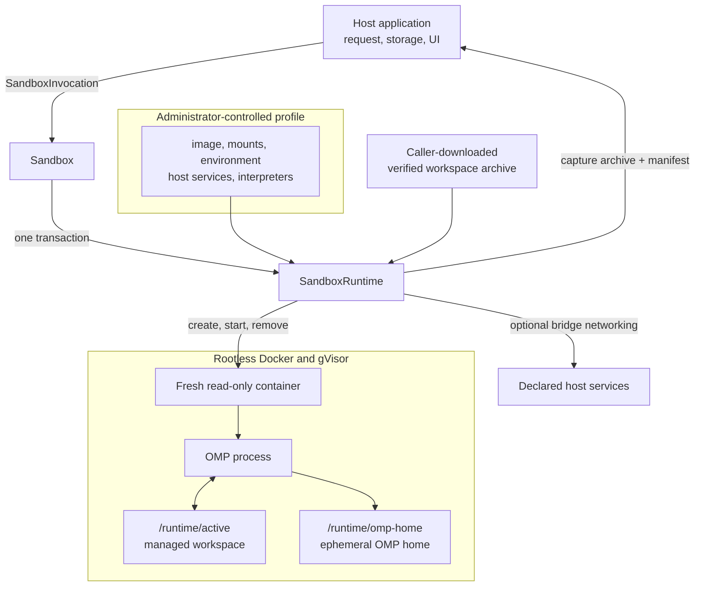

# Agents-in-a-Box

**Secure orchestration layer for autonomous coding agents.** Wraps code execution into a heavily restricted, sandboxed runtime.

---

## 🎯 Purpose

Coding agents typically run directly on the host machine with full user privileges

By default this means:
*   **Arbitrary code generation & execution**
*   **Nearly unrestricted filesystem access**
*   **Unrestricted network access**

While coding agents typically ask for permission or filter auto-approval for harmful commands, they can technically send any user-accessible (private) data to any publicly accessible domain, download & install arbitrary software in the userspace or execute arbitrary code.

---


## Security architecture: defense in depth

### 1. Runtime isolation

Each managed OMP invocation receives a **fresh** container. The runtime force-removes it after completion or failure.

- **[Rootless Docker](https://docs.docker.com/engine/security/rootless/):** container UID `0` maps to an unprivileged host user
- **[gVisor](https://github.com/google/gvisor):** `runsc` places a user-space kernel between the workload and the host kernel interface
- **Explicit container policy:** all Linux capabilities dropped, `no-new-privileges`, read-only root filesystem, 4 GiB memory limit, two CPUs, and 100-process limit
- **Bounded writable paths:** `/runtime` is a 1 GiB `nosuid,nodev` tmpfs and `/tmp` is a 64 MiB `nosuid,nodev` tmpfs
- **Ephemeral OMP home:** OMP receives a transaction-local writable home. No live container, writable OMP home, or active-state marker is reused

The resource limits are required, not aspirational. Doctor rejects a daemon configuration containing `--ignore-cgroups` and starts a minimal limited container to verify that the registered runtime can actually enforce the policy.

### 2. Filesystem scoping and workspace continuity

A profile grants exact host paths. Mounts are administrator-controlled policy, not agent input.

- Profiles permit read-only (`ro`) and read-write (`rw`) bind mounts explicitly
- Managed workspace continuity uses caller-owned, SHA-256-verified tar archives only
- Restore and capture reject traversal paths, unsafe links, device nodes, FIFOs, unsupported entries, and archives larger than 512 MiB
- Captures stream into a private local temporary file, are revalidated against the restore policy, and are returned to the caller for durable upload
- Bind mounts inside the managed workdir are excluded from captures so host-mounted material is not republished as workspace data

### 3. Network and output boundaries

Managed OMP containers and Doctor probes use Docker bridge networking. Disposable Python execution is network-disabled.

- A profile may explicitly expose a declared host service as `http://<routable-host-address>:<port>`
- The runtime does not install firewall rules, enforce an egress allowlist, or isolate the host LAN
- Managed OMP runs time out after 300 seconds
- Prompt images are limited to 32 MiB combined
- Retained stdout and stderr are limited to 4 MiB combined


```mermaid
flowchart TD
    HostApp["Host application<br/>request, storage, UI"] -->|SandboxInvocation| Facade[Sandbox]
    Facade -->|one transaction| Runtime[SandboxRuntime]

    subgraph Policy[Administrator-controlled profile]
        Profile["image, mounts, environment<br/>host services, interpreters"]
    end

    Profile --> Runtime
    ArchiveIn["Caller-downloaded<br/>verified workspace archive"] --> Runtime

    subgraph Isolation[Rootless Docker and gVisor]
        Container[Fresh read-only container]
        OMP[OMP process]
        Workspace["/runtime/active<br/>managed workspace"]
        OMPHome["/runtime/omp-home<br/>ephemeral OMP home"]
        Container --> OMP
        OMP <--> Workspace
        OMP --> OMPHome
    end

    Runtime -->|create, start, remove| Container
    Runtime -->|optional bridge networking| Services[Declared host services]
    Runtime -->|capture archive + manifest| HostApp
```

---

## Usage

### 1. Install and diagnose

The setup script supports Debian, Ubuntu, and Arch Linux on `x86_64` or `aarch64`. It requires a user systemd session. It uses `sudo` only when it must install rootless Docker packages or configure subordinate IDs.

```bash
uv sync
./scripts/setup_agent_sandbox.sh
uv run agent-sandbox doctor --profile gigachad
```

The setup script installs or reuses rootless Docker, downloads and SHA-512-verifies `runsc`, registers it with the rootless daemon without `--ignore-cgroups`, restarts the user Docker service, and builds `agent-sandbox:trixie`.

Doctor exits `0` only when every check passes. It checks the profile, Docker connection, rootless mode, registered `runsc`, daemon cgroup configuration, image, and declared mount sources. It then starts one minimal limited container before checking OMP, Python interpreters, `AGENTS.md`, and declared host services.

If Doctor reports `runsc-rootless-cgroups` with `Interactive authentication required`, the host is affected by gVisor issue #11543. Do not add `--ignore-cgroups`. That workaround disables the CPU, memory, and PID limits required by this project.

### 2. Run a managed OMP invocation

The caller supplies stable request identity and, where needed, a workspace archive it has already downloaded. The caller uploads the returned capture and persists the returned manifest.

```python
from agent_sandbox import Sandbox, SandboxInvocation

sandbox = Sandbox(namespace="tenant-a")
invocation = SandboxInvocation(
    slot_key="workspace-42",
    run_id="request-2026-09-19-01",
    profile_name="gigachad",
    prompt="Summarize the current workspace.",
    workspace_archive_path=None,
    active_manifest=None,
)

with sandbox.run(invocation) as result:
    upload_capture(result.capture_path)
    persist_manifest(result.next_manifest)
    print(result.status, result.summary)
    print(result.outputs)
```

`slot_key` and `run_id` provide in-process idempotency within one `Sandbox` instance. Releasing the returned `SandboxRun`, either explicitly or through the context manager, removes its local capture and evicts that cached result.

For a resumed workspace, provide both the prior manifest and the caller-downloaded archive. For a first invocation with an archive, also provide its lowercase 64-character SHA-256 as `workspace_archive_sha256`.

The returned manifest is storage-neutral and the capture is a local temporary artifact. While the run is retained, `SandboxRun.read_workspace_file()` safely validates the capture and reads one bounded regular workspace file, such as `plot.json`. Call `release()` only after the caller has persisted the data it needs.

### 3. Run OMP through the standalone wrapper

Library use remains the primary integration. The `agent-sandbox omp` command is available for a single profiled run when files are the integration boundary. Its required `--workspace-out` and `--manifest-out` paths receive the workspace capture and native JSON manifest. Their parent directories must already exist.

```bash
mkdir -p artifacts

agent-sandbox omp "Summarize the current workspace." \
  --profile gigachad \
  --slot-key workspace-42 \
  --run-id request-2026-09-19-01 \
  --workspace-out artifacts/workspace.tar \
  --manifest-out artifacts/manifest.json
```

To resume, pass both prior outputs as inputs. `--manifest-in` requires `--workspace-in`.

```bash
agent-sandbox omp "Continue the workspace." \
  --profile gigachad \
  --workspace-in artifacts/workspace.tar \
  --manifest-in artifacts/manifest.json \
  --workspace-out artifacts/next-workspace.tar \
  --manifest-out artifacts/next-manifest.json
```

The command persists the returned capture and JSON manifest before releasing the local run. It prints `status`, `summary`, and serialized output events. A returned status other than `completed` exits with code `1` after those files are written.

### 4. Run a small isolated Python task

Choose a profile-defined interpreter label, never a host interpreter path.

```python
from agent_sandbox import run_python_script

output = run_python_script(
    "venv",
    "print('hello from the sandbox')",
    timeout=30,
    profile_name="gigachad",
)
print(output)
```

This path starts a fresh, read-only, network-disabled container and removes it after execution.

---

## Profiles

Profiles are strict YAML files named `<profile>.yaml`. The loader searches the colon-separated `AGENT_SANDBOX_PROFILE_PATH` before bundled profiles. `gigachad.yaml` is an example for one workstation. Copy it into an administrator-controlled location and replace its absolute paths for a different machine.

```yaml
name: example
image: agent-sandbox:trixie
workdir: /workspace
mounts:
  - source: /absolute/host/path/to/omp
    target: /usr/local/bin/omp
    mode: ro
  - source: /absolute/host/path/to/project-instructions
    target: /workspace/AGENTS.md
    mode: ro
workspace:
  mode: managed
omp_binary: /usr/local/bin/omp
python_interpreters:
  venv: /opt/example-venv/bin/python3
env_passthrough:
  - OPENAI_API_KEY
host_services:
  OLLAMA_HOST: 11434
```

Required fields are `name`, `image`, `workdir`, `mounts`, `workspace`, and `omp_binary`. Optional fields are `python_interpreters`, `env_passthrough`, and `host_services`.

Profile validation rejects duplicate YAML keys, unknown fields, unsafe names, non-absolute paths, conflicting mount targets, mounts into runtime-owned paths, invalid environment names, and invalid host-service ports. The runtime fingerprint combines the validated profile, static runtime policy, and Docker-resolved image ID. A changed profile or image prevents restoration from a prior manifest.

> Treat profiles as trusted administrator policy. A profile can deliberately grant a secret, writable host directory, or reachable host service. Use read-only mounts whenever possible and grant only the environment variables and services required by the workload.

---

## Limits and operational boundaries

| Boundary | Policy |
| --- | --- |
| Managed OMP timeout | 300 seconds |
| Prompt-image payload | 32 MiB combined |
| Retained OMP output | 4 MiB combined |
| Workspace restore archive | 512 MiB |
| Workspace capture archive | 512 MiB |
| `/runtime` tmpfs | 1 GiB |
| `/tmp` tmpfs | 64 MiB |
| Container memory | 4 GiB |
| Container CPU | 2 CPUs |
| Container PIDs | 100 |

Agents-in-a-Box reduces risk. It does not make trusted mounts, forwarded secrets, configured host services, or bridge-network reachability safe by itself. The host application must decide what to persist, expose, and authorize.
