# Agents-in-a-Box

**Secure orchestration layer for autonomous coding agents.** Wraps CLI agents into a heavily restricted, ephemeral, sandboxed runtime.

**Supported Agents:**
*   [Open Code](https://opencode.ai/)
*   [Aider](https://aider.chat/)
*   [Gemini CLI](https://github.com/google-gemini/gemini-cli)
*   [Qwen Code](https://github.com/QwenLM/qwen-code)
*   [Codex](https://github.com/openai/codex)
*   [Claude Code](https://github.com/anthropics/claude-code)
*   [Cursor CLI](https://cursor.com/agents)

Supports CPU/GPU local inference by linking the Docker subnet to a static alias.

https://github.com/user-attachments/assets/e57c43c6-4791-4bf8-a877-793d286880f2

---

## 🎯 Purpose

Code agents typically run directly on the host machine with full user privileges

By default this means:
*   **Arbitrary Code Generation & Execution**
*   **Unrestricted Filesystem Access**
*   **Unrestricted Network Access**

While the supported Frameworks ask for permission before visiting a website or modifying files, they can technically send any user-accessible (private) data to any publicly accessible domain or download & install arbitrary software in the userspace.

---

## 🛡️ Security Architecture: **Defense-in-Depth**

**1. Runtime Isolation**

Inside the container the agent receives an dedicated guest kernel with severly restricted capabilities for root users. But even in the event of a container breakout, the attacker finds themselves with zero permissions on the host filesystem.

*   **[gVisor (runsc)](https://github.com/google/gvisor):** Intercepts system calls in a distinct user-space kernel. Rejects system calls with system privileges. Significantly reduces risk for kernel exploits.
*   **[Rootless Docker](https://docs.docker.com/engine/security/rootless/):** Maps the container's `root` (UID 0) to a non-privileged UID on the host.
*   **Ephemeral Lifecycle:** All runtime installations are destroyed after execution.

**2. Network Hardening**

Enables secure CPU/GPU local inference. No access to the host LAN or local network peers. Prevents internal network scanning.

*   **Non-Routable Aliasing:** Routes LLM traffic through a static loopback alias (`10.200.200.1`). 
*   **Interface Isolation:** Air-gaps container traffic from access to the local network.
*   **Egress Control:** Facilitates deterministic firewalls (UFW/IPTables).

**3. Filesystem Scoping & Persistence Control**

Only git-tracked changes for human inspection remain after execution. Other sections of the OS cannot be modified by the agent.

```mermaid
graph TD
    subgraph Host["Host Machine (User Space)"]
        UI[Streamlit Orchestrator]
        Git[Local Git Repo]
        LLM[Local LLM / Ollama]
        
        subgraph NetControl["🛡️ Network Gatekeeper"]
            Firewall[UFW / Bridge Alias]
        end

        subgraph Isolation["Runtime Environment"]
            Docker[Rootless Docker]
            gVisor["gVisor (runsc)"]
            
            subgraph Container["🐳 Docker Sandbox"]
                Agent[Agent Process]
                Mount[Bind-Mounted Codebase]
            end
        end
    end
    
    WWW[World Wide Web]

    %% Control Flow
    UI -->|1. Spawns| Docker
    Docker -->|2. Wraps| gVisor
    gVisor -->|3. Isolates| Agent
    
    %% Data Flow
    Agent <-->|Read/Write| Mount
    Mount <-->|Sync| Git
    
    %% Network Routing (Interception)
    Agent -.->|Traffic Out| Firewall
    Firewall -.->|Allow: 10.200.x.x| LLM
    Firewall -.->|Allow: Whitelist| WWW
```

*   **Bind-Mount Isolation:** The agent is physically scoped to `~/agent_workspace/<repo>`. No visibility into host `$HOME`, SSH keys, or environment secrets.



---

## 🔌 Extensibility
Designed for ease of extensibility. All core features are implemented in a abstract base class.
- New agents require only class inheritance and a **Pydantic model** for CLI argument validation.
- UI form is dynamically generated from the **Pydantic model**.

---

## 🚀 Usage

**1. Infrastructure & Build**
```bash
./scripts/setup-agent-sandbox.sh       # Init Rootless Docker & gVisor
python src/docker/dockerimage-bakery.py # Compile immutable agent images
```

**2. Network Bridge (Optional for Local Inference)**
```bash
# Create non-routable alias & allow Docker subnet access
sudo ip addr add 10.200.200.1/32 dev lo
sudo ufw allow from 172.17.0.0/16 to 10.200.200.1 port 11434 proto tcp
```

**3. Run Orchestrator**
```bash
streamlit run src/app.py
```
